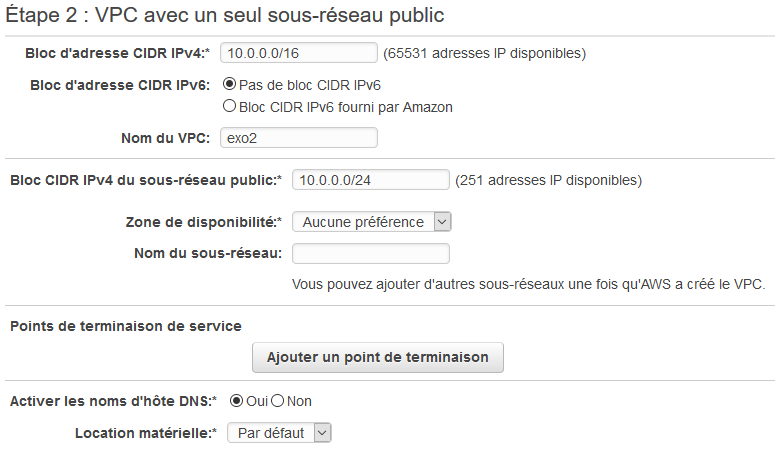
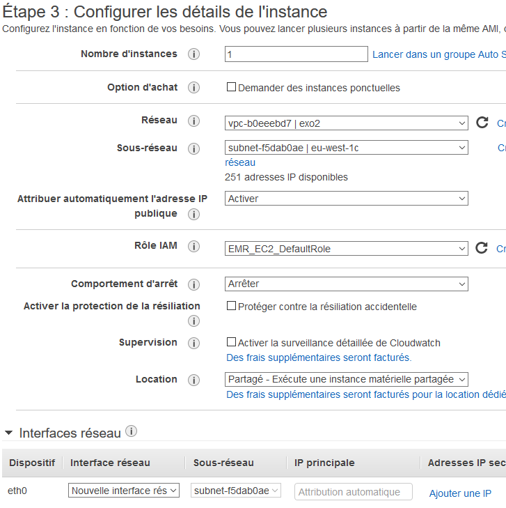
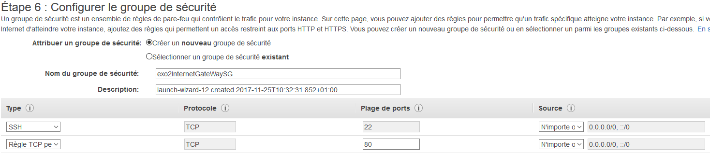
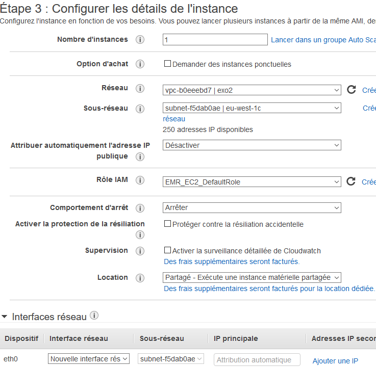
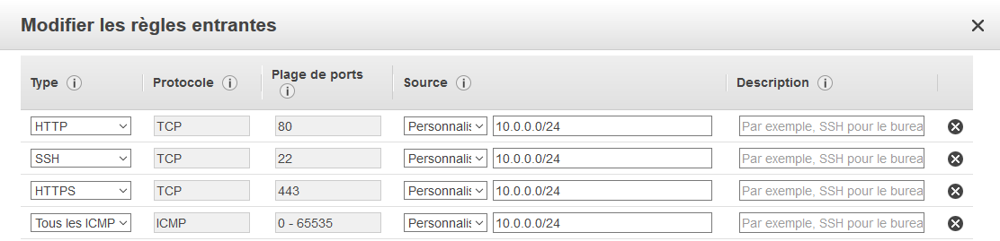

**step 1** Create a VPC containing a private network

**step 1** Create a VPC containing a private network
**step 2** Create the first EC2, that will be used as a gateway by the other EC2, which will be connected only to the private network. 
Choose to activate the automatic P address allocation, so that EC2 will be connected both on the private AND the public network..

**step 1** Create a VPC containing a private network
**step 3** Configure the security group so that you can connect to the instance via SSH, and that the instance can connect to internet.

**step 1** Create a VPC containing a private network
**step 4** Create the 2nd instance, but don't give it a public IP.

**step 1** Create a VPC containing a private network
**step 5** Open these ports to the private ip of the previous instance, so both can connect to each other.
