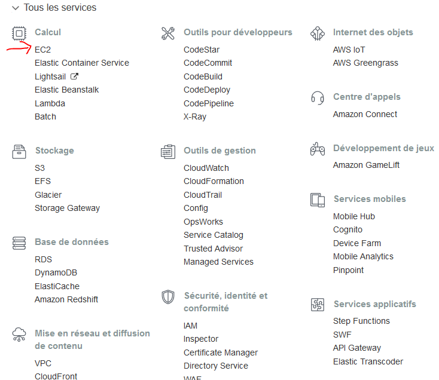

**step 1** Select the EC2 service on the AWS homepage, then click on the blue button “Launch instance”

_________________________________________________________________________________________________________________

**step 2** Choose t2.micro 

_________________________________________________________________________________________________________________

**step 3** Configure the security group by adding an entrance by the port 8787, and open it to every source. Use default settings for the other parameters of the instance.

_________________________________________________________________________________________________________________

**step 4** 

_________________________________________________________________________________________________________________

**step 5** When launching the instance, select an existing key pair, or create a new one.

_________________________________________________________________________________________________________________

**step 6** With Putty, connect to the instance using the public IP of the instance given in the instances manager. 
Use this to connect to the instance : ec2-user@[your public IP]

_________________________________________________________________________________________________________________

**step 7** Load the PEM key that you obtained from AWS, then Save the private key to the .ppk format.
_________________________________________________________________________________________________________________

**step 8**Choose the .ppk key then connect to the instance.
Run the following commands in the instance
sudo –s

#install R
yum update
su -c 'rpm -Uvh http://download.fedoraproject.org/pub/epel/6/i386/epel-release-6-8.noarch.rpm'
yum install R

#install R server
yum install wget
wget https://download2.rstudio.org/rstudio-server-rhel-1.1.383-x86_64.rpm
sudo yum install --nogpgcheck rstudio-server-rhel-1.1.383-x86_64.rpm

Connect to the instance from your web browser using this address:

-your-public-dns-:8787
